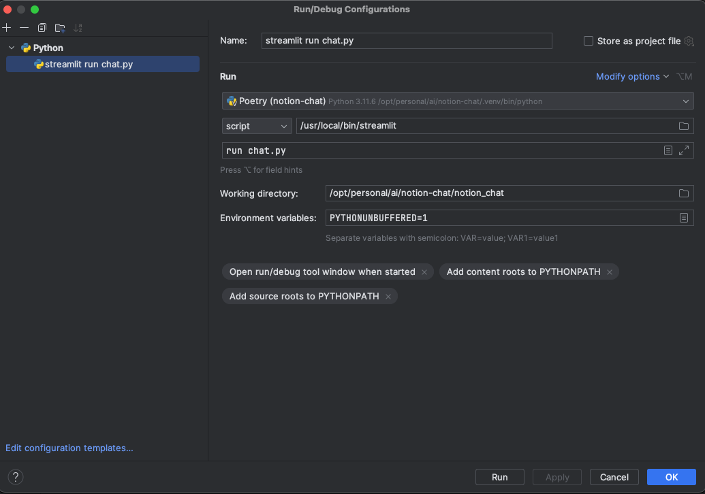

# Chatbot to answer your questions as a conversational agent from a Notion knowledge base
[](https://www.python.org/downloads/release/python-380/)
[](https://johntday-notion-chat-chat-xcbtq4.streamlit.app/)
[](https://opensource.org/licenses/MIT)

## Purpose
An experimental AI chatbot using Notion database as knowledge base. The chatbot is built using
- [Streamlit](https://streamlit.io/) for the web app
- [Qdrant](https://qdrant.tech/) for vector search
- [OpenAI](https://openai.com/blog/openai-api/) for text generation and embeddings
- [Notion](https://developers.notion.com/) for fetching content and metadata from Notion database

## HOW TO RUN THE APP LOCALLY
Follow these steps to set up and run the python app locally :

### Prerequisites
- Python 3.8 or higher
- Git
- Poetry

### Installation
Clone the repository :

```bash
git clone https://github.com/johntday/notion-chat.git
```

Navigate to the project directory :

```bash
cd notion-chat
```

Create a virtual environment and install requirements using Poetry :
```bash
poetry install
```

Run the app locally :

```bash
cd notion_chat
streamlit run chat.py
```

### Pycharm Run Configuration

If you are using Pycharm, you can create a run configuration to run the app locally :



## References
- [Streamlit](https://streamlit.io/)
- [Qdrant](https://qdrant.tech/)
- [OpenAI](https://openai.com/blog/openai-api/)
- [Notion](https://developers.notion.com/)
- [Langchain](https://python.langchain.com/)
- [Using Poetry](https://johntday.github.io/python-poetry/)
